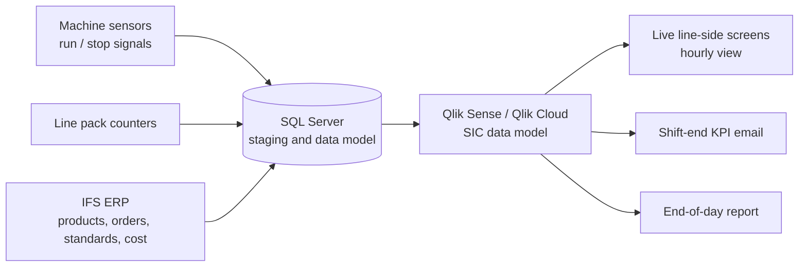

# SIC – Short Interval Control Dashboard

**Live, line-side production reporting for a food manufacturing site**

Built for a UK FMCG food manufacturer · Qlik Sense / Qlik Cloud · SQL Server · IFS ERP · Machine sensor and counter data

> The data, screenshots and scripts in this repository are rebuilt with **simulated data** to show the approach. They contain no real company data.

---

## At a glance

| | |
|---|---|
| **What it is** | A live dashboard on a screen next to each production line, showing hourly output, downtime, waste, cost, productivity and efficiency |
| **Data sources** | Machine sensors and pack counters on every line, combined with ERP data |
| **Replaced** | Paper A3 sheets on every line and shift, manual Excel entry, and next-day KPI reviews |
| **Result** | Contributed to a **1.2% increase in overall productivity over six months**, and the gain has held since |

---

## The problem

Before SIC, production tracking on the factory floor was entirely paper-based:

- Every line had an **A3 paper sheet for each shift**, filled in by hand.
- **Every hour**, the person running the line had to walk to the office to enter the figures.
- At the end of each shift and each production day, the figures were **consolidated into an Excel file** and emailed to the Operations managers.
- KPIs were only discussed **the next day** in the daily meeting.

This meant downtime, waste and slow running were seen **a day late**, when it was too late to fix them. Operators were spending time on data entry instead of running the line, and hand-copied figures were prone to errors.

## What I built

I fully automated this process and removed paper from the factory floor.

1. **Laptops on every line** replaced the A3 sheets. The cost of the laptops over three years was covered by the savings on paper, printing and the labour spent on manual data entry.
2. **Live data straight from the line:** pack counts from every line's counters, and downtime calculated from the machine sensors.
3. **ERP data combined with machine data** for product, order, standard and cost information, so the dashboard shows cost and efficiency as well as volume.
4. **A live SIC dashboard on a screen next to each line**, updated in real time and broken down hour by hour, showing:
   - production numbers against target
   - downtime (when, how long, and how often)
   - wastage
   - cost
   - productivity and efficiency
5. **Automated email reports:**
   - **shift-end KPI comparison** (this shift against target and previous shifts)
   - **end-of-day report** for the Operations managers

No one enters data into Excel any more, and no one walks to the office every hour.

## How it works

## KPIs on the dashboard

| KPI | What it shows |
|---|---|
| **Production** | Packs produced per hour and per shift, against target |
| **Downtime** | Stoppage time and number of stops, calculated from the machine sensors |
| **Wastage** | Waste recorded against good output |
| **Cost** | Production and waste cost, using ERP cost data |
| **Productivity** | Output against the hours available |
| **Efficiency** | Actual output against the standard rate for the product being run |

## Impact

- **1.2% increase in overall productivity over six months, and the gain has held.** This came from supervisors being able to see downtime and other problems **as they happened**, and fix them straight away or escalate them, instead of waiting for the next day's meeting.
- **Paper removed from the factory floor**, with no printing and no filing.
- **No manual data entry** and no hourly trips to the office for line operators.
- **One version of the figures** from shift level up to management, with fewer errors from hand-copied data.
- The **laptop investment paid for itself** over three years through savings on paper, printing and labour.

## My role

I led this project from start to finish:

- worked with production supervisors, line leaders and Operations managers to understand the paper process and what they needed to see during a shift
- designed the data flow from sensors, counters and ERP into SQL Server and Qlik
- built the data model, load scripts and dashboards
- set up the automated shift-end and end-of-day email reports
- tested the dashboard with supervisors, adjusted it based on their feedback, and trained the teams on the line
- supported the rollout and the change away from paper

## Tools and skills

`Qlik Sense` `Qlik Cloud` `SQL Server` `IFS ERP` `Data modelling` `ETL` `Real-time reporting` `Report automation` `Manufacturing KPIs` `Requirements gathering` `Change management`

## What's in this repository

| Folder | Contents |
|---|---|
| `/data` | Simulated sample data: line counters, downtime events and ERP-style product and cost tables |
| `/sql` | SQL scripts for the staging tables and KPI calculations |
| `/qlik` | Example load script (.qvs) |
| `/screenshots` | Dashboard screenshots rebuilt with sample data |

---

**Jose Paul Irimpan** – Senior BI Analyst | Qlik, Power BI, SQL Server
[LinkedIn](https://www.linkedin.com/in/jose-paul-irimpan-a4331741/)
