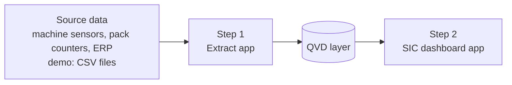
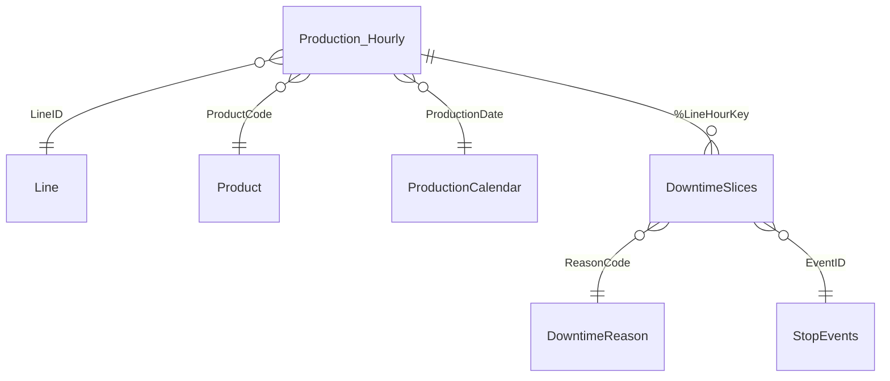

# Qlik files

| File | Description |
|---|---|
| `SIC_01_extract_to_qvd.qvs` | Step 1: reads each source table and stores it as a QVD file |
| `SIC_load_script.qvs` | Step 2: the SIC dashboard app. Loads only from the QVD files, splits sensor stop events into hourly slices, joins counter and ERP data, and builds the production calendar and KPI variables |
| `measures.md` | KPI definitions and the Qlik expressions behind the SIC screens |

## QVD architecture

## Data model

## How to run it

1. Create a folder data connection called **SIC_Demo**. Upload the CSV files from `/data` into it, and create an empty sub-folder called **QVD**.
2. Create an app for step 1, paste `SIC_01_extract_to_qvd.qvs` and click **Load data**. This creates the QVD files.
3. Create the dashboard app, paste `SIC_load_script.qvs` and click **Load data**.
4. Build the sheets using the measures in `measures.md`.

In Qlik Cloud the file connection is usually `lib://DataFiles/`. Change the paths at the top of both scripts to match.

The key step is in the **Downtime** section: sensor stops don't start and end on the hour, so each stop is split across the hours it covers. That way downtime minutes line up exactly with the hourly pack counts on the line screen.
