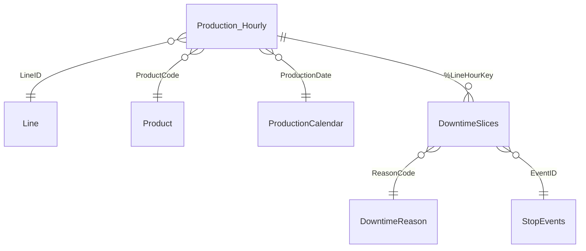

# Qlik files

| File | Description |
|---|---|
| `SIC_load_script.qvs` | Load script: loads the sample data, splits sensor stop events into hourly slices, joins counter and ERP data, and builds the production calendar and KPI variables |
| `SIC_load_script_multi_line.qvs` | Generic multi-line version: loads line-side SIC sheets for several areas from one config table, turns the cumulative pack counter into hourly packs, and calculates efficiency, downtime, giveaway and cost by shift. Connection and file names are placeholders |
| `measures.md` | KPI definitions and the Qlik expressions behind the SIC screens |

## Data model

## How to run it

1. In Qlik Sense or Qlik Cloud, create a new app.
2. Upload the CSV files from `/data` and create a folder data connection called **SIC_Demo** that points to them.
3. Paste `SIC_load_script.qvs` into the data load editor and click **Load data**.
4. Build the sheets using the measures in `measures.md`.

The key step is in the **Downtime** section: sensor stops don't start and end on the hour, so each stop is split across the hours it covers. That way downtime minutes line up exactly with the hourly pack counts on the line screen.
